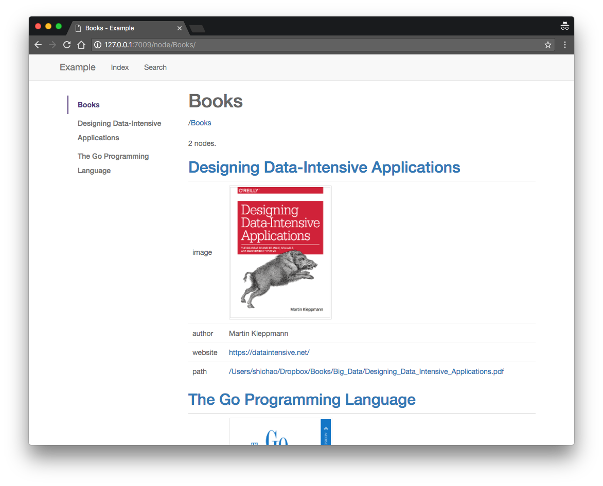

## Momo

Momo is a simple file manager to organize files that can scatter around various sources. It groups files based on a bucket document that you defined. For now only YAML-based document is supported.

### Built-in Features

- Write your bucket documents in YAML.
- Browse and manage files from the command-line.
- View and search files from a Web UI based on Flask.
- Extend and customize the Flask plugin.

### Example

[example.yml](example/example.yml) is an example bucket document in YAML. Here's a screenshot of the Web viewer:

[](example/example.png "Example Screenshot")


### Development

```bash
python setup.py develop
```
